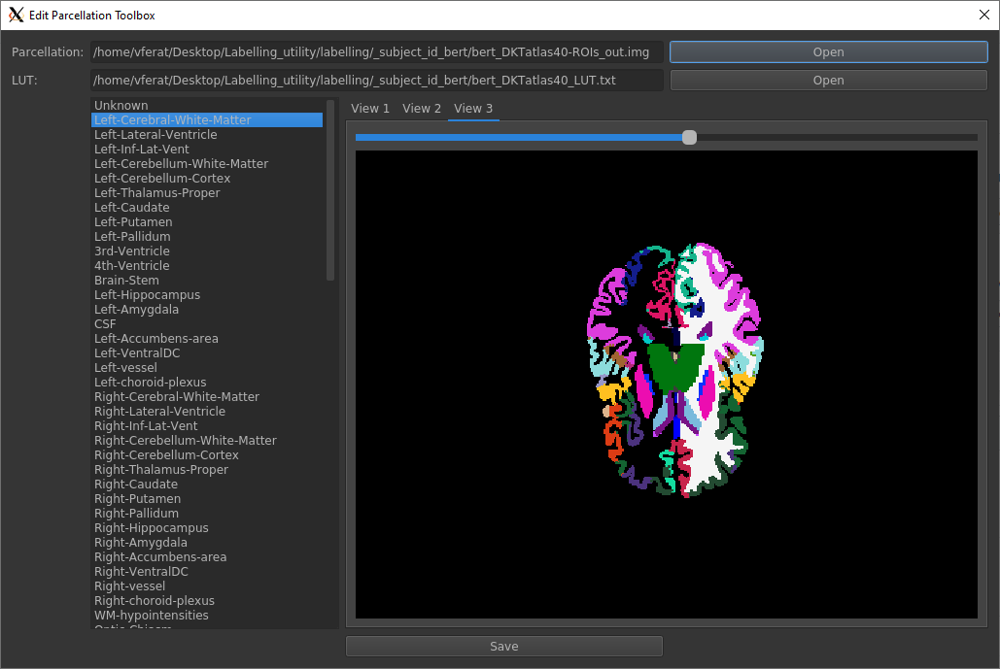

# ParcEdit
A Graphical interface to remove region of interest from Freesurfer parcellation.



This toolbox can be used to set all voxels belong to one or several region of interest to unknow. It could be useful for MEG/EEG source space postionning.
## Installation

To install the toolbox, clone this repository:

`git clone https://github.com/vferat/ParcEdit.git`

Then go to the repository main folder and install dependencies:

```
cd ParcEdit
pip install -r requirements.txt
```

## Run

The run the toolbox, go to the repository main folder and type:

`python -m parcedit`

then load a parcellation file (**.nii**, **.nii.gz**, **.img**) and the corresponding freesurfer lookup table (**.txt**).

## Theme

By default, the toolboxe use default GUI theme, you can use dark mode by
installing [qtmodern](https://github.com/gmarull/qtmodern).

`pip install qtmodern`
